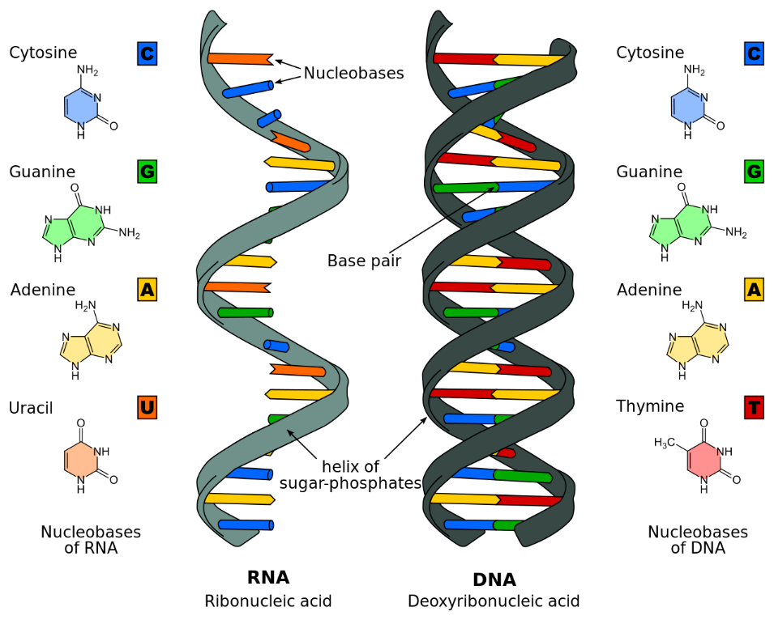

# Prediction of RNA-RNA Interaction using Deep Learning
Ribonucleic acid (RNA) is a polymeric molecule essential in various biological roles in coding, decoding, regulation and expression of genes. RNA and DNA are nucleic acids, and along with lipids, proteins and carbohydrates, constitute the four major macromolecules essential for all known forms of life. Like DNA, RNA is assembled as a chain of nucleotides.

RNA binding protein play a crucial role in gene regulation. Experimental approaches for detecting the protein binding sites on RNAs are time consuming and costly. Intelligent algorithms can replace the time consuming traditional methods. But the efficient representation of RNA sequences is always a challenge. The quality of which directly impact the accuracy of the learning algorithm. K-mer representation is widely followed method. The better approach could be to learn the distribute representation of the k-mers and represent the sequence. 
In this project deep learning methods were used to predict RNA-RNA interaction (RRI) from the sequencing based training data. RISE dataset was used for modeling and validation. RISE provides a comprehensive collection of RRIs that mainly come from recent transcriptome-wide sequencing-based experiments like PARIS, SPLASH, LIGR-seq, and MARIO, as well as targeted studies like RIA-seq, RAP-RNA and CLASH [2]. Each row of the dataset contains a pair of RNAs that supposedly interact with each other. The vector representation of the samples were prepared for each RNA using K-mer composition. Then the vector representation for each sample of the dataset was created by concatenating the corresponding vector of its two constituents RNAs. This was then used for training CNN algorithm for predicting the RRI (RNA-RNA interaction). 

References:

[1] Predicting the sequence specificities of DNA and RNA-binding proteins by deep learning - Babak Alipanahi et al.

[2] RISE: a database of RNA interactome from sequencing experiments - Jing Gong et al.
